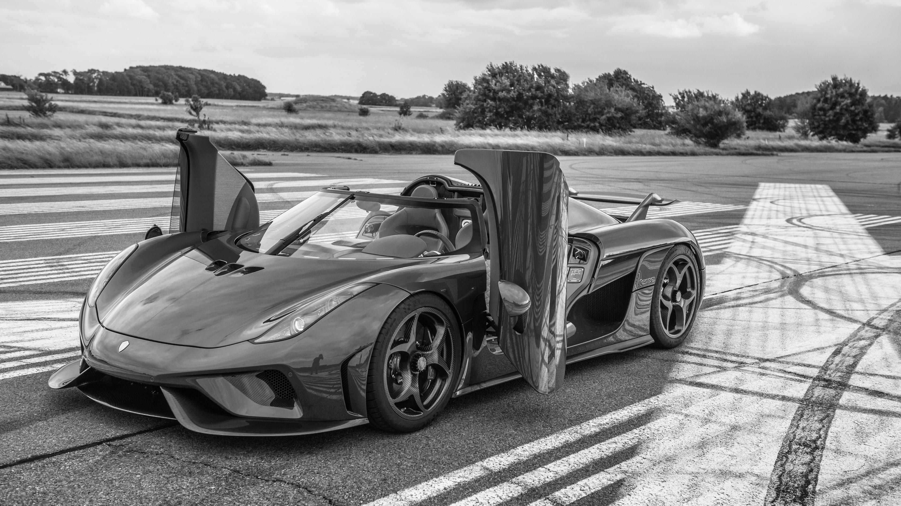
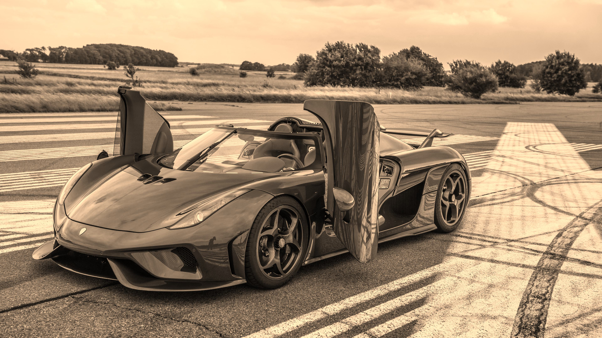

<h1 align="center">🎨 PILPaint – Image Colorization & Image Processing using Python</h1>
<p align="center">
  <strong>By: Mubasshir Ahmed | FSDS Daily Task</strong><br>
  <em>Powered by:</em> Python 🐍 • Pillow 🖼 • NumPy 🧮 • Matplotlib 📊
</p>

---

## 📌 Project Overview

**PILPaint** is a complete hands-on project that demonstrates both basic and advanced image processing techniques using the **Pillow (PIL)** library in Python.

The project is divided into two parts:

- 🧱 **Basic Transformations** – RGB channel analysis, rotation, flipping, and artistic filters
- 🎨 **Colorization Pipeline** – Grayscale to RGB reconstruction, tinting, blending, and output comparison

This project is ideal for anyone learning:

- Machine Learning / Computer Vision preprocessing
- Image manipulation fundamentals
- Artistic image enhancements

---

## 🧭 Folder Structure

```
PILPaint-Image-Colorization-Pipeline/
├── input/                      # Original input image
├── output/                     # All generated outputs
├── notebooks/
│   ├── Basic_Image_Processing_with_PIL.ipynb
│   └── PILPaint_Image_Colorization.ipynb
├── requirements.txt
└── README.md
```

---

## 📓 Notebooks Overview

| Notebook                                 | Description                                                         |
| ---------------------------------------- | ------------------------------------------------------------------- |
| 🧱 Basic_Image_Processing_with_PIL.ipynb | Loading image, RGB visualization, flip/rotate, and built-in filters |
| 🎨 PILPaint_Image_Colorization.ipynb     | Manual grayscale colorization via RGB merge, tinting, and blending  |

---

## ✨ Key Features

- ✅ RGB Channel Inspection with NumPy
- ✅ Artistic Filters: Blur, Sharpen, Contour, Detail, Edges
- ✅ Grayscale Conversion using `.convert("L")`
- ✅ Manual RGB Merging and Tinting
- ✅ Image Blending for Stylized Effects
- ✅ Professional-quality Notebook Formatting
- ✅ Real project structure with input/output separation

---

## 📸 Sample Outputs

| Original                | Grayscale               | RGB Merge                   | Tinted                       | Blended                         |
| ----------------------- | ----------------------- | --------------------------- | ---------------------------- | ------------------------------- |
|  |  |  |  |  |

🗂️ Filtered Outputs (e.g., blur, contour, sharpen) are also available in `/output/`.

---

## 🛠️ Tech Stack

- Python 3.x
- Pillow (PIL)
- NumPy
- Matplotlib
- Jupyter Notebook

---

## 🚀 How to Run This Project

```bash
git clone https://github.com/mubasshirahmed-3712/PILPaint-Image-Colorization-Pipeline.git
cd PILPaint-Image-Colorization-Pipeline
pip install -r requirements.txt
jupyter notebook notebooks/PILPaint_Image_Colorization.ipynb
```

---

## 👨‍💻 Author

**Mubasshir Ahmed**
🔗 GitHub: [@mubasshirahmed-3712](https://github.com/mubasshirahmed-3712)
🎓 FSDS Daily Task • Guided by Kodigit

---

> ⭐ If you found this project helpful, consider starring the repo!
